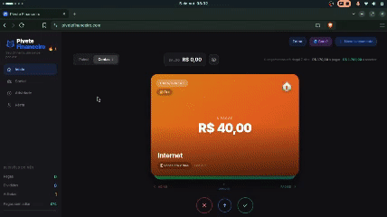
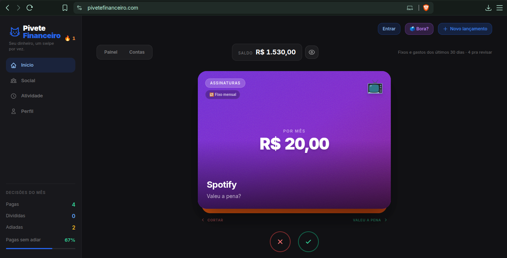
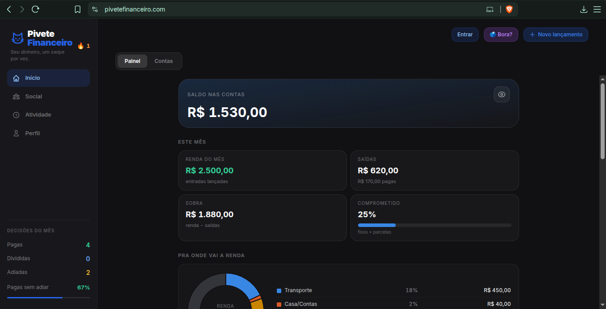
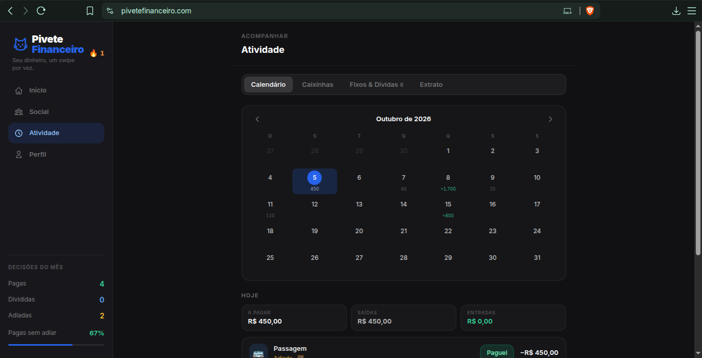

<picture>
  <source media="(prefers-color-scheme: dark)" srcset="docs/assets/trocado-giz.svg">
  
</picture>

# pivete financeiro

**tuas contas viram cards. tu decide em um gesto.**
sem planilha, sem coach, sem conectar banco.

<!-- Coloque aqui um GIF do swipe (recomendado: 600px de largura, até 10 MB) -->

  

---

## Sobre

O **Pivete Financeiro** é um app de finanças pessoais para quem ganha pouco e não sabe para onde o dinheiro vai. Em vez de planilhas, categorias e gráficos que ninguém abre, cada conta vira um **card**, e o usuário resolve a pendência com um gesto, no estilo dos apps de match.

A proposta é reduzir a fricção de cuidar do próprio dinheiro ao mínimo possível: abrir o app, decidir o que fazer com cada conta em segundos e seguir o dia.

## Como funciona

| gesto | ação | o que acontece |
|:---:|---|---|
| **→** | **paguei** | a conta sai da fila e entra no histórico do mês |
| **←** | **adiar** | a conta volta mais tarde, sem culpa |
| **↑** | **rachar** | a conta é dividida com outras pessoas e vira cobrança |

## Funcionalidades

- **Fila de contas em cards** com gestos de arrastar, animados com física de mola.
  

  
   início: as contas em cards, prontas pro swipe

- **Painel** com a visão do mês: o que foi pago, o que está pendente e o que vence em breve.

  

  
   painel: o que foi pago, o que tá pendente e o que vence

- **Atividade**, um histórico de tudo que foi decidido.

  

  
   atividade: o histórico do mês

- **Social**: dividir contas com amigos e acompanhar cobranças.
- **Gamificação** para tornar o hábito de organizar as contas mais leve.
- **PWA instalável**, que funciona offline e abre como app nativo no celular.

<!-- Prints: substitua pelos seus arquivos em docs/ -->

## Decisões técnicas

**Offline-first.** O app é uma PWA que persiste o estado localmente e continua funcionando sem conexão; o Supabase entra como backend de dados. A ideia é que registrar uma conta nunca dependa de internet, já que o público-alvo muitas vezes usa dados móveis limitados.

**Dinheiro em centavos inteiros.** Todos os valores são armazenados e calculados como inteiros em centavos e só são formatados em R$ na interface. Isso elimina erros de arredondamento de ponto flutuante (o clássico `0.1 + 0.2 !== 0.3`), que são inaceitáveis em um app financeiro.

**Gestos como interface principal.** A interação de swipe foi construída com Framer Motion, com limiares de distância e velocidade para distinguir intenção de toque acidental, e cada direção mapeada para uma ação de negócio.

**Sem conexão bancária.** O app não usa Open Finance nem pede credenciais de banco. O usuário cadastra as próprias contas, o que mantém o escopo de dados pequeno e a privacidade sob controle dele.

**Testes.** A lógica de domínio (cálculos, divisão de contas, regras de vencimento) é coberta por testes unitários com Vitest.

## Stack

| camada | tecnologias |
|---|---|
| Front-end | React 18, Vite, Tailwind CSS |
| Animação e gestos | Framer Motion |
| Gráficos | Recharts |
| Back-end e dados | Supabase |
| Plataforma | PWA (instalável, offline) |
| Testes | Vitest |
| Deploy | Vercel |

## Status

🚧 **Em desenvolvimento ativo.** A versão atual está disponível em **[pivetefinanceiro.com](https://pivetefinanceiro.com)**.

## Código-fonte

Este repositório é uma vitrine do projeto. **O código-fonte é privado.** Se quiser conversar sobre a arquitetura, as decisões técnicas ou o produto, fique à vontade para entrar em contato.

## Autor

**Rafael Severo**, estudante de Engenharia de Software (IDP) com foco em dados.

<!--  -->

---

© 2026 Pivete Financeiro. Todos os direitos reservados.

